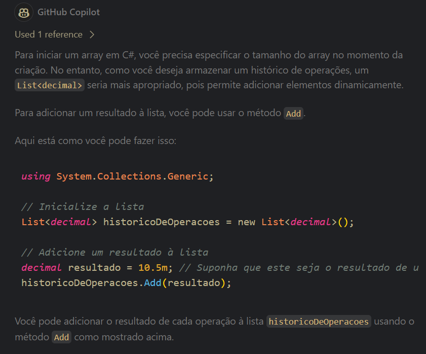
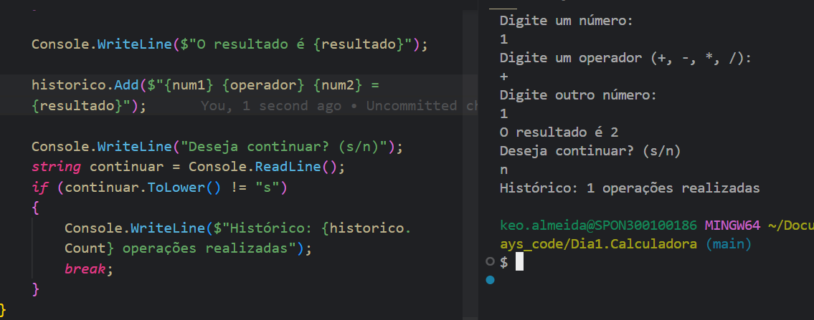

# 7DaysCode
<!-- Descrição: Crie uma calculadora que realiza operações básicas e mantém um histórico das operações realizadas.

Objetivos:
Receber dois números do usuário.
Solicitar a operação desejada (+, -, *, /).
Realizar a operação e exibir o resultado.
Manter um histórico das operações realizadas e exibi-lo quando solicitado. -->

Dúvidas:

- como posso iniciar um array que vai ser minha lista de resultado de operações já feitas anteriormente? qual metodo eu posso usar para pegar o resultado e colocar nessa lista?

-

- dificuldade em entender classe
- onde coloco a classe

_________________________________________________________________

ERROS da v1:

C:\Users\keo.almeida\Documents\ESTUDOS\7_days_code\Dia1.
Calculadora\Program.cs(17,27): warning CS8618: O proprie
dade não anulável 'TipoDeOperacao' precisa conter um val
or não nulo ao sair do construtor. Considere declarar o 
propriedade como anulável. [C:\Users\keo.almeida\Documen
ts\ESTUDOS\7_days_code\Dia1.Calculadora\Dia1.Calculadora
.csproj]
C:\Users\keo.almeida\Documents\ESTUDOS\7_days_code\Dia1.
Calculadora\Program.cs(54,21): error CS0103: O nome "tip
oDeOperacao" não existe no contexto atual [C:\Users\keo.
almeida\Documents\ESTUDOS\7_days_code\Dia1.Calculadora\D
ia1.Calculadora.csproj]
C:\Users\keo.almeida\Documents\ESTUDOS\7_days_code\Dia1.
Calculadora\Program.cs(57,21): error CS0103: O nome "res
ultado" não existe no contexto atual [C:\Users\keo.almei
da\Documents\ESTUDOS\7_days_code\Dia1.Calculadora\Dia1.C
alculadora.csproj]
C:\Users\keo.almeida\Documents\ESTUDOS\7_days_code\Dia1.
Calculadora\Program.cs(57,33): error CS0103: O nome "Sum
" não existe no contexto atual [C:\Users\keo.almeida\Doc
uments\ESTUDOS\7_days_code\Dia1.Calculadora\Dia1.Calcula
dora.csproj]
C:\Users\keo.almeida\Documents\ESTUDOS\7_days_code\Dia1.
Calculadora\Program.cs(58,21): error CS0103: O nome "tip
oDeOperacao" não existe no contexto atual [C:\Users\keo.
almeida\Documents\ESTUDOS\7_days_code\Dia1.Calculadora\D
ia1.Calculadora.csproj]
C:\Users\keo.almeida\Documents\ESTUDOS\7_days_code\Dia1.
Calculadora\Program.cs(59,65): error CS0103: O nome "res
ultado" não existe no contexto atual [C:\Users\keo.almei 
da\Documents\ESTUDOS\7_days_code\Dia1.Calculadora\Dia1.C 
alculadora.csproj]
C:\Users\keo.almeida\Documents\ESTUDOS\7_days_code\Dia1. 
Calculadora\Program.cs(62,21): error CS0103: O nome "res 
ultado" não existe no contexto atual [C:\Users\keo.almei 
da\Documents\ESTUDOS\7_days_code\Dia1.Calculadora\Dia1.C 
alculadora.csproj]
C:\Users\keo.almeida\Documents\ESTUDOS\7_days_code\Dia1. 
Calculadora\Program.cs(62,33): error CS0103: O nome "Sub 
" não existe no contexto atual [C:\Users\keo.almeida\Doc 
uments\ESTUDOS\7_days_code\Dia1.Calculadora\Dia1.Calcula 
dora.csproj]
C:\Users\keo.almeida\Documents\ESTUDOS\7_days_code\Dia1. 
Calculadora\Program.cs(63,21): error CS0103: O nome "tip 
oDeOperacao" não existe no contexto atual [C:\Users\keo. 
almeida\Documents\ESTUDOS\7_days_code\Dia1.Calculadora\D 
ia1.Calculadora.csproj]
C:\Users\keo.almeida\Documents\ESTUDOS\7_days_code\Dia1. 
Calculadora\Program.cs(64,70): error CS0103: O nome "res 
ultado" não existe no contexto atual [C:\Users\keo.almei 
da\Documents\ESTUDOS\7_days_code\Dia1.Calculadora\Dia1.C 
alculadora.csproj]
C:\Users\keo.almeida\Documents\ESTUDOS\7_days_code\Dia1. 
Calculadora\Program.cs(67,21): error CS0103: O nome "res 
ultado" não existe no contexto atual [C:\Users\keo.almei 
da\Documents\ESTUDOS\7_days_code\Dia1.Calculadora\Dia1.C 
alculadora.csproj]
C:\Users\keo.almeida\Documents\ESTUDOS\7_days_code\Dia1. 
Calculadora\Program.cs(67,33): error CS0103: O nome "Mul 
t" não existe no contexto atual [C:\Users\keo.almeida\Do 
cuments\ESTUDOS\7_days_code\Dia1.Calculadora\Dia1.Calcul 
adora.csproj]
C:\Users\keo.almeida\Documents\ESTUDOS\7_days_code\Dia1. 
Calculadora\Program.cs(68,21): error CS0103: O nome "tip 
oDeOperacao" não existe no contexto atual [C:\Users\keo. 
almeida\Documents\ESTUDOS\7_days_code\Dia1.Calculadora\D 
ia1.Calculadora.csproj]
C:\Users\keo.almeida\Documents\ESTUDOS\7_days_code\Dia1. 
Calculadora\Program.cs(69,73): error CS0103: O nome "res 
ultado" não existe no contexto atual [C:\Users\keo.almei 
da\Documents\ESTUDOS\7_days_code\Dia1.Calculadora\Dia1.C 
alculadora.csproj]
C:\Users\keo.almeida\Documents\ESTUDOS\7_days_code\Dia1. 
Calculadora\Program.cs(72,21): error CS0103: O nome "res 
ultado" não existe no contexto atual [C:\Users\keo.almei 
da\Documents\ESTUDOS\7_days_code\Dia1.Calculadora\Dia1.C 
alculadora.csproj]
C:\Users\keo.almeida\Documents\ESTUDOS\7_days_code\Dia1. 
Calculadora\Program.cs(72,33): error CS0103: O nome "Div 
" não existe no contexto atual [C:\Users\keo.almeida\Doc 
uments\ESTUDOS\7_days_code\Dia1.Calculadora\Dia1.Calcula 
dora.csproj]
C:\Users\keo.almeida\Documents\ESTUDOS\7_days_code\Dia1. 
Calculadora\Program.cs(73,21): error CS0103: O nome "tip 
oDeOperacao" não existe no contexto atual [C:\Users\keo. 
almeida\Documents\ESTUDOS\7_days_code\Dia1.Calculadora\D 
ia1.Calculadora.csproj]
C:\Users\keo.almeida\Documents\ESTUDOS\7_days_code\Dia1. 
Calculadora\Program.cs(74,68): error CS0103: O nome "res 
ultado" não existe no contexto atual [C:\Users\keo.almei 
da\Documents\ESTUDOS\7_days_code\Dia1.Calculadora\Dia1.C 
alculadora.csproj]
C:\Users\keo.almeida\Documents\ESTUDOS\7_days_code\Dia1.
Calculadora\Program.cs(80,26): error CS0266: Não é possí 
vel converter implicitamente tipo "decimal" em "int". Ex 
iste uma conversão explícita (há uma conversão ausente?) 
 [C:\Users\keo.almeida\Documents\ESTUDOS\7_days_code\Dia 
1.Calculadora\Dia1.Calculadora.csproj]
C:\Users\keo.almeida\Documents\ESTUDOS\7_days_code\Dia1. 
Calculadora\Program.cs(81,26): error CS0266: Não é possí 
vel converter implicitamente tipo "decimal" em "int". Ex 
iste uma conversão explícita (há uma conversão ausente?) 
 [C:\Users\keo.almeida\Documents\ESTUDOS\7_days_code\Dia 
1.Calculadora\Dia1.Calculadora.csproj]
C:\Users\keo.almeida\Documents\ESTUDOS\7_days_code\Dia1. 
Calculadora\Program.cs(82,34): error CS0103: O nome "tip 
oDeOperacao" não existe no contexto atual [C:\Users\keo. 
almeida\Documents\ESTUDOS\7_days_code\Dia1.Calculadora\D 
ia1.Calculadora.csproj]
C:\Users\keo.almeida\Documents\ESTUDOS\7_days_code\Dia1. 
Calculadora\Program.cs(83,29): error CS0103: O nome "res 
ultado" não existe no contexto atual [C:\Users\keo.almei 
da\Documents\ESTUDOS\7_days_code\Dia1.Calculadora\Dia1.C 
alculadora.csproj]
C:\Users\keo.almeida\Documents\ESTUDOS\7_days_code\Dia1. 
Calculadora\Program.cs(39,44): warning CS8604: Possível  
argumento de referência nula para o parâmetro 's' em 'de 
cimal decimal.Parse(string s)'. [C:\Users\keo.almeida\Do 
cuments\ESTUDOS\7_days_code\Dia1.Calculadora\Dia1.Calcul 
adora.csproj]
C:\Users\keo.almeida\Documents\ESTUDOS\7_days_code\Dia1. 
Calculadora\Program.cs(42,44): warning CS8604: Possível  
argumento de referência nula para o parâmetro 's' em 'de 
cimal decimal.Parse(string s)'. [C:\Users\keo.almeida\Do 
cuments\ESTUDOS\7_days_code\Dia1.Calculadora\Dia1.Calcul 
adora.csproj]
C:\Users\keo.almeida\Documents\ESTUDOS\7_days_code\Dia1. 
Calculadora\Program.cs(45,38): warning CS8604: Possível  
argumento de referência nula para o parâmetro 's' em 'in 
t int.Parse(string s)'. [C:\Users\keo.almeida\Documents\ 
ESTUDOS\7_days_code\Dia1.Calculadora\Dia1.Calculadora.cs 
proj]

Ocorreu uma falha no build. Corrija os erros de build e execute novamente.

_________________________________________________________________

- como fazer um historico de operações feitas, em detalhes?

